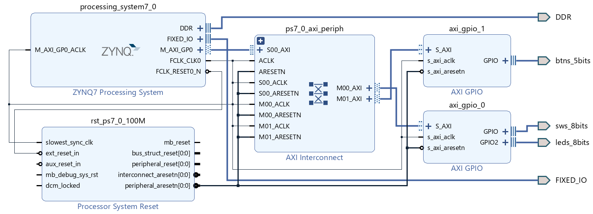
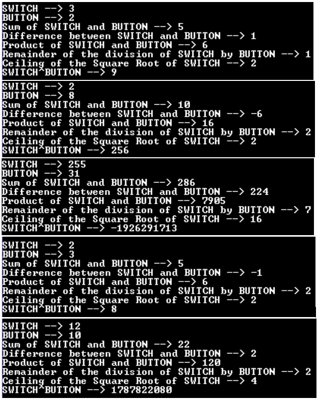

# UART_GPIO
### A software application on ARM processing system to control hardware that is implemented in programmable logic and communication using UART
-------------------------------------------------------------------------------------------------------------------

### Tools:  	
* Vivado 2020.2  
* Xilinx Vitis 2020.2 
* Tera Term 4.105
### Device:
* Zedboard 
---------------------------------------------------------------------------------------------------------

### Hardware
* ARM Cortex A9 core (PS)
* UART for serial communication
* DDR3 controller for external DDR3 SDRAM memory
* AXI Interconnect block
* Two instances pf GPIO peripheral

------------------------------------------------------------------------------------------------------------
### Arithmetic Operations
* Addition of switches an buttons
* Difference between switches and buttons
* Product of switches and buttons
* Remainder of the division of switches by buttons
* Ceiled square root of switches
* Calculation of power where switches as base and buttons as exponent
-------------------------------------------------------------------------------------------------------------
### Serial Communication Settings
* Connection type: Serial
* Port: COM4
* Baud Rate: 115200
* Data bits: 8
* Stop bits: 1
* Parity: None
* Flow Control: None
---------------------------------------------------------------------------------------------------------------
### Output

---------------------------------------------------------------------------------------------------------------
### For Video demonstration click the image below

